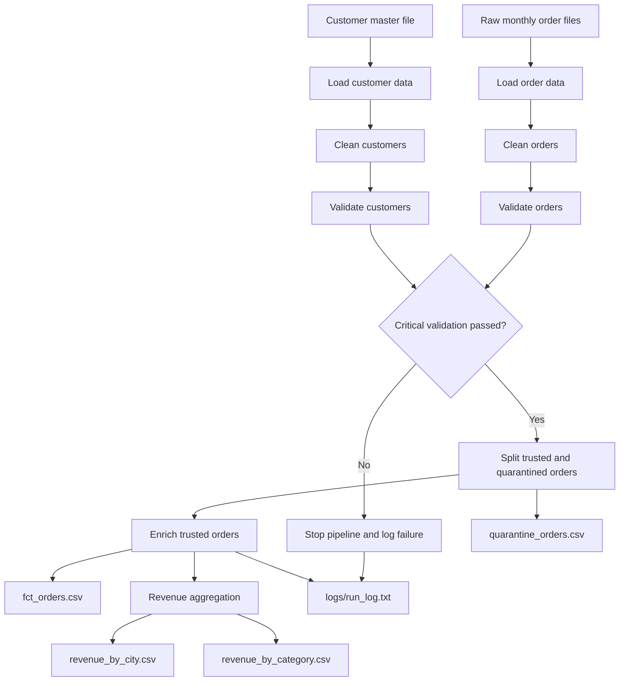

# Shop Pipeline — Data Lineage

The diagram shows how raw order and customer data moves through the pipeline to produce trusted datasets, quarantined records, and revenue summaries.

```mermaid
flowchart TD
    A["Raw monthly order files"] --> C["Load order data"]
    B["Customer master file"] --> D["Load customer data"]

    C --> E["Clean orders"]
    D --> F["Clean customers"]

    E --> G["Validate orders"]
    F --> H["Validate customers"]

    G --> I{"Critical validation passed?"}
    H --> I

    I -->|No| J["Stop pipeline and log failure"]
    I -->|Yes| K["Split trusted and quarantined orders"]

    K --> L["Enrich trusted orders"]
    L --> M["fct_orders.csv"]
    K --> N["quarantine_orders.csv"]

    L --> O["Revenue aggregation"]
    O --> P["revenue_by_city.csv"]
    O --> Q["revenue_by_category.csv"]

    J --> R["logs/run_log.txt"]
    L --> R
```